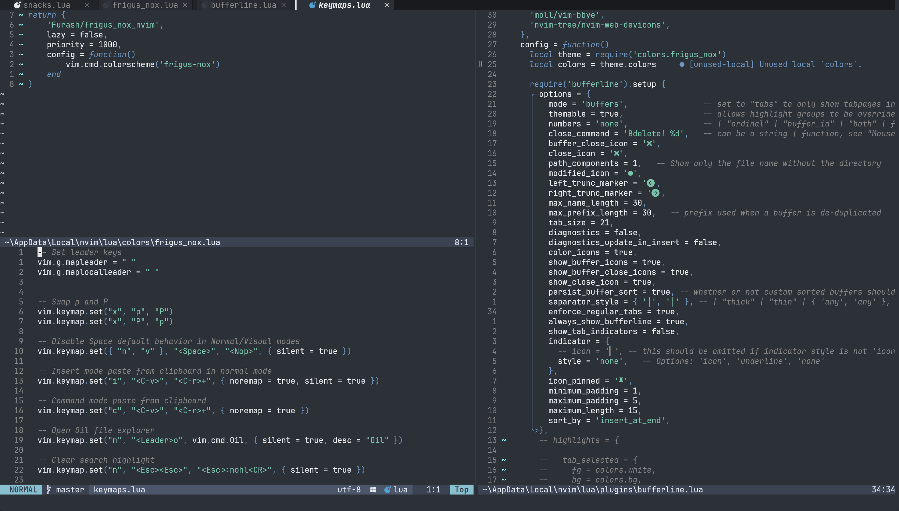

Frigus Nox theme for neovim



## Installation

### Lazy.nvim
```lua
{
    'Furash/frigus_nox_nvim',
    lazy = false,
    priority = 1000,
    config = function()
        vim.cmd.colorscheme('frigus-nox')
    end
}
```

Lazy.nvim:

```lua
vim.cmd.colorscheme('frigus-nox')
```

## Plugin Support
The colorscheme automatically configures the following plugins if they are installed:
- lualine
- bufferline

No additional configuration is needed for these plugins - they will automatically use the Frigus Nox theme.

